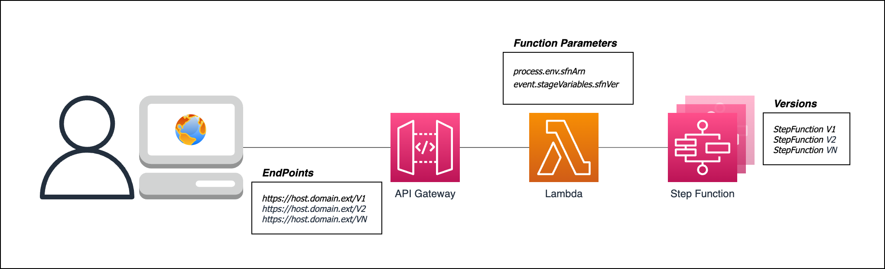

# Publish different version of AWS Step Function using AWS API Gateway

You have one [AWS Step Function](https://aws.amazon.com/step-functions/) and you want to invoke it via API using [AWS API Gateway](https://aws.amazon.com/api-gateway/).

You also require to publish multiple version of the same Step Function.

In this post I will show one simple and effective way to achieve that.

Using AWS Cloud Development Kit ([CDK](https://aws.amazon.com/cdk/)) stack to automate the creation of resources reduce the risk of mistakes.

## Overview

There are three main components in this example:
- [AWS Step Function](https://aws.amazon.com/step-functions/): is the core of the ‘solution’. The CDK stack creates it and publishes version 1. It doesn't require inputs and returns ‘Version Alpha’.
- [AWS Lambda](https://aws.amazon.com/lambda/): the CDK stack deploys a Lambda function. The function contains the logic to invoke the right step function version.
- [AWS API Gateway](https://aws.amazon.com/apigateway/): the CDK stack automates the API creation. It also creates the GET method that triggers the Lambda.

In the diagram you can see a client application being able to send different API version requests to API Gateway. The API triggers the same Lambda function that invokes the correct Step Function version:

 
In the next paragraph, I am going to show you how to automate the following steps:
- Deploy a demo AWS Step Function
- Deploy a AWS Lambda capable to invoke the AWS Step Function
- Create a AWS API Gateway API
- Create a GET invoke that triggers the AWS Lambda
- Deploy a AWS API Gateway Stage to a specific URL that invoke a specific AWS StepFunction Version

In addition to the previous, I am going to show you how to:
- Apply changes to your AWS Step Function
- Publish a new AWS Step Function Version
- Deploy a new AWS API Gateway Stage to a specific URL that invoke a specific AWS StepFunction Version

## Walkthrough

In order to implement the example, you will need to go through the steps below:
- clone this code repository to get the needed CDK stacks
- deploy the stack [01_StepFunction-Lambda-ApiGw](./01_StepFunction-Lambda-ApiGw)
- configure & deploy the stack [02_ApiGwStage](./02_ApiGwStage)
- modify the step function & publish a new version
- re-configure & re-deploy the stack 02_ApiGwStage

## Prerequisites

For this walkthrough, you should have the following prerequisites: 
- An AWS account
- Visual Studio Code
- [AWS CDK](https://aws.amazon.com/cdk/)

## First Deployment
Below the steps for the end to end process:
1. go to [01_StepFunction-Lambda-ApiGw](./01_StepFunction-Lambda-ApiGw)and follow instruction for deployment and validation.
2. go to Step Functions console, click on the step function name (MyDemoStepFunction) and select the tab ‘versions’ to get the version number.
3. go to [02_ApiGwStage](./02_ApiGwStage) and follow instruction for deployment and validation. (use 1 for API_VERSION and the value you get at step 2 for SFN_VERSION)

## Create new step function version

You can now amend the MyDemoStepFunction and publish a new version.
To create a new Step Function version
1.	Open AWS Step Functions console (click here).
2.	Click on MyDemoStepFunction to open it and then select Edit.
3.	Click on Pass State element and then select output.
4.	Change the result from “version Alpha” to (for example) “version Beta” and then Save
5.	From the drop-down Actions select Publish a version (in the popup type a numeric value) and select Publish

## Second Deployment
Below the steps for the end to end process:
1. go to Step Functions console, click on the step function name (MyDemoStepFunction) and select the tab ‘versions’ to get the version number.
2. go to [02_ApiGwStage](./02_ApiGwStage) and follow instruction for deployment and validation. (use 2 for API_VERSION and the value you get at step 2 for SFN_VERSION)

## Conclusion

You have now been able to automate the creation of API Gateway API, Lambda function and Step Function.
You also have been able to automate the creation of new API stages that, when invoked, trigger the configured Step Function version.
The process can be repeated to publish several versions of the same Step Function (each one with its own API Gateway Stage).

### Cleaning up

To avoid incurring future charges, delete the resources following the steps in each of the sracks.

## Security

See [CONTRIBUTING](./CONTRIBUTING.md#security-issue-notifications) for more information.

## Code of Conduct

See [CODE OF CONDUCT](./CODE_OF_CONDUCT.md) for more information.

## License

This library is licensed under the MIT-0 License. See the [LICENSE](./LICENSE) file.
